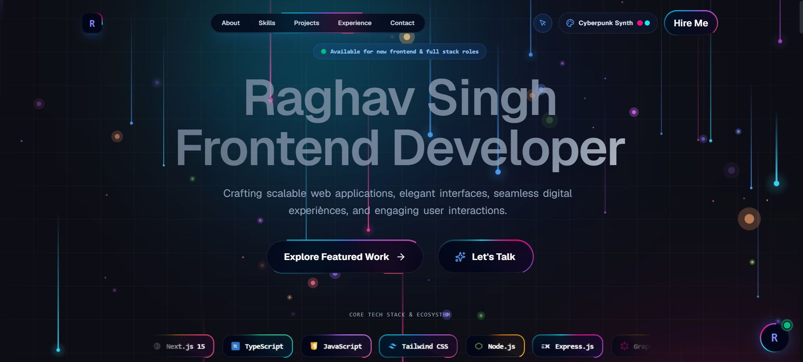

# ⚡ Raghav Singh — Modern Frontend Developer Portfolio

A high-performance, visually rich personal developer portfolio built with **Next.js 16 (App Router)**, **React.js**, **TypeScript**, **Tailwind CSS**, **Framer Motion**, and **Reactbits**.



---

## ⚡ Overview

This portfolio showcases production-grade web applications, interactive canvas micro-interactions, Theme preset switching, an embedded AI Career Assistant, interactive code playground, performance memoization, and responsive glassmorphic design.

---

## ✨ Features & Highlights

- **🚀 60 FPS High Performance**: Component memoization (`React.memo`), GPU-accelerated canvas particles & dynamic lazy loading.
- **🎨 Theme Preset Switcher**: Live theme switching (**Modern Dark**, **Tokyo Night**, **Cyberpunk**, **Dracula**) with dynamic glowing borders.
- **🤖 AI Career Assistant**: Embedded AI Chatbot trained on work experience, technical stack, projects & contact info.
- **💻 Code Playground & Terminal**: Interactive code previewer and mini terminal for exploring technical samples.
- **📜 PDF Resume Modal**: Embedded interactive PDF resume viewer with instant download controls.
- **💎 Micro-Interactions**: Magnetic cursor, glowing border buttons, 3D tilt cards & sliding Framer Motion navbar indicator.

---

## 🛠️ Tech Stack Table

| Category       | Technology                                                             |
| :------------- | :--------------------------------------------------------------------- |
| **Framework**  | [Next.js 16 (App Router)](https://nextjs.org/) with Turbopack          |
| **Library**    | [React 19](https://react.dev/)                                         |
| **Language**   | [TypeScript](https://www.typescriptlang.org/)                          |
| **Styling**    | [Tailwind CSS](https://tailwindcss.com/), Glassmorphism, CSS Variables |
| **Animations** | [Framer Motion](https://www.framer.com/motion/), HTML5 Canvas 2D API   |
| **Icons**      | [Lucide React](https://lucide.dev/), Custom Brand SVGs                 |

---

## 🚀 Getting Started & Build Commands

### 1. Prerequisites

Ensure you have **Node.js 18+** installed.

### 2. Installation

```bash
# Install all dependencies (1-click)
npm install
```

### 3. Run Development Server

```bash
npm run dev
```

Open [http://localhost:3000](http://localhost:3000) in your browser to view the site.
